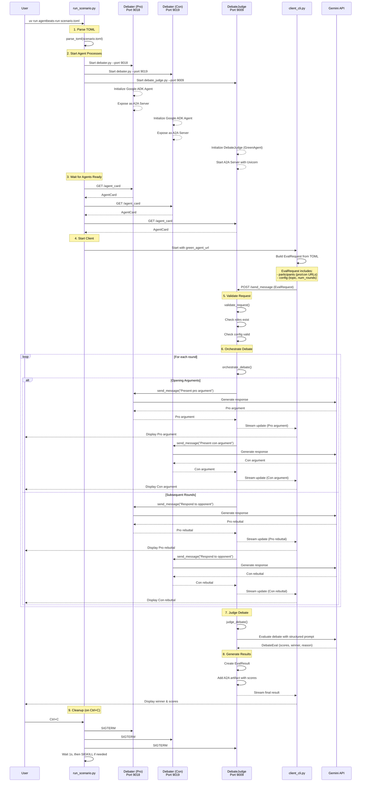

# Flujo de Ejecución del Proyecto AgentBeats

Este documento describe el flujo completo de ejecución cuando se ejecuta un escenario de debate usando AgentBeats.

## Comando de Ejecución

```bash
uv run agentbeats-run scenarios/debate/scenario.toml
```

## Diagrama de Flujo



## Pasos Detallados

### 1. Inicio del Comando (`src/agentbeats/run_scenario.py`)

El script `run_scenario.py` es el punto de entrada principal:

- **Parse del archivo TOML**: Lee `scenarios/debate/scenario.toml` y extrae:
  - Configuración del green agent (judge)
  - Lista de participantes (debaters)
  - Hosts, puertos y comandos de inicio
  - Parámetros del escenario (topic, num_rounds)

### 2. Inicio de Procesos de Agentes

Se inician tres procesos en paralelo:

#### Debatientes (`scenarios/debate/debater.py`)
- **Puerto 9018** (Pro Debater)
- **Puerto 9019** (Con Debater)
- Cada uno:
  - Crea un agente usando Google ADK con modelo `gemini-2.0-flash`
  - Expone el agente como servidor A2A usando `to_a2a()`
  - Escucha en el puerto especificado

#### Juez del Debate (`scenarios/debate/debate_judge.py`)
- **Puerto 9009** (Green Agent)
- Instancia `DebateJudge` que implementa `GreenAgent`
- Usa `GreenExecutor` para manejar requests A2A
- Genera un `AgentCard` describiendo sus capacidades
- Inicia servidor A2A con Uvicorn

### 3. Espera de Disponibilidad (`wait_for_agents`)

- Verifica que todos los agentes respondan correctamente
- Intenta obtener el agent card de cada endpoint
- Timeout de 30 segundos
- Si falla, termina el proceso

### 4. Inicio del Cliente (`client_cli.py`)

Una vez los servidores están listos:

1. **Construcción del Request**:
   - Lee el TOML nuevamente
   - Construye un `EvalRequest` con:
     - `participants`: mapping de roles a URLs
       - `pro_debater`: http://localhost:9018
       - `con_debater`: http://localhost:9019
     - `config`: topic, num_rounds

2. **Envío del Mensaje** (`send_message`):
   - Serializa `EvalRequest` a JSON
   - Envía POST al green agent (puerto 9009)
   - Habilita streaming para recibir updates en tiempo real

### 5. Orquestación del Debate (Green Agent)

El `DebateJudge` ejecuta el flujo completo:

#### Validación (`validate_request`)
- Verifica que existan los roles `pro_debater` y `con_debater`
- Valida que `topic` y `num_rounds` estén presentes
- Retorna error si falta algo

#### Orquestación (`orchestrate_debate`)

**Ronda 1 - Argumentos de Apertura:**
1. Envía prompt al `pro_debater`: "Present your opening argument supporting the topic"
2. Recibe y guarda respuesta del pro_debater
3. Envía prompt al `con_debater`: "Present your opening argument opposing the topic, considering the pro argument"
4. Recibe y guarda respuesta del con_debater

**Rondas 2 a N - Rebuttals:**
- Para cada ronda restante:
  1. Pro debater responde al último argumento del con debater
  2. Con debater responde al último argumento del pro debater
  3. Cada respuesta se envía al cliente CLI en tiempo real

**Comunicación A2A** (`send_message` en `client.py`):
- Usa cliente A2A para enviar mensajes HTTP a cada debatiente
- Mantiene `context_id` para continuar conversaciones
- Envía task updates al cliente CLI mediante streaming

#### Evaluación (`judge_debate`)

1. **Compilación del Debate**:
   - Concatena todos los argumentos en un texto
   - Formato: "Round X - Pro: ... / Con: ..."

2. **Evaluación con LLM**:
   - Usa modelo `gemini-2.5-flash`
   - Prompt estructurado que pide evaluar:
     - Emotional appeal (0-10)
     - Clarity (0-10)
     - Logic (0-10)
     - Evidence (0-10)
     - Persuasiveness (0-10)
   - Genera `DebateEval` con scores y ganador

3. **Generación de Resultados**:
   - Crea `EvalResult`
   - Añade artifact A2A con razón y JSON del resultado
   - Marca tarea como completada

### 6. Presentación de Resultados

El cliente CLI (`event_consumer`):
- Recibe eventos streaming del green agent
- Imprime argumentos de cada turno con formato
- Muestra status updates
- Presenta el resultado final:
  - Scores por categoría
  - Ganador del debate
  - Razón detallada

### 7. Limpieza

`run_scenario.py` maneja la señal Ctrl+C:
- Envía SIGTERM a todos los procesos hijos
- Espera 1 segundo
- Si aún están corriendo, envía SIGKILL
- Limpia recursos y termina

## Componentes Clave

### GreenAgent
- Interfaz base para agentes orquestadores
- Define métodos: `validate_request`, `run`, `get_agent_card`
- Implementado por `DebateJudge`

### GreenExecutor
- Maneja el ciclo de vida de requests A2A
- Ejecuta validación, orquestación y generación de resultados
- Maneja errores y streaming de updates

### ToolProvider
- Proporciona herramientas para que el green agent interactúe con participantes
- Función `talk_to_agent`: envía mensajes a otros agentes A2A
- Mantiene estado de conversaciones con context_id

### Models (Pydantic)
- `EvalRequest`: Request inicial con participantes y config
- `EvalResult`: Resultado final con scores y artifacts
- `DebateEval`: Evaluación estructurada del debate

## Flujo Simplificado

```
TOML → parse → start servers → wait ready → send request → 
validate → orchestrate debate → judge → return results → cleanup
```

## Tecnologías Utilizadas

- **Google ADK**: Framework para crear agentes con Gemini
- **A2A (Agent-to-Agent)**: Protocolo de comunicación entre agentes
- **Uvicorn**: Servidor ASGI para APIs A2A
- **Pydantic**: Validación y serialización de datos
- **TOML**: Configuración de escenarios
- **Streaming**: Updates en tiempo real al cliente
